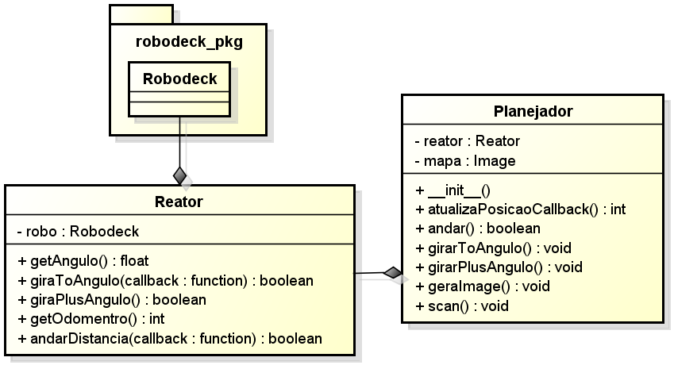

# Simulador do Robodeck em Python

Este é o simulador do Robodeck desenvolvido usando Python com Pygame.

## O Robodeck

O Robodeck é uma plataforma robótica para uso geral e permite utilizar diversos sensores.


## Itens do projeto

- Modulo python `robodeck_pkg` (O simulador)
- Exemplo de arquitetura Planejador-reator
- Diagrama de classes

## Requerimentos

```bash
# Install python 2
sudo apt install python2.7

# Install PIP 2
curl https://bootstrap.pypa.io/pip/2.7/get-pip.py --output get-pip.py
sudo python2 get-pip.py

# Install PyGame for Python2 (Global)
sudo pip2 install pygame

# Install PIL for Python2
sudo apt install python-pil

# Install MatPlotLib for Python2
sudo pip2 install matplotlib

# Install python TK
sudo apt install python-tk
```

## Documentação do módulo `robodeck_pkg`

Use o mouse para gerar um obstáculo no cenário através de dois cliques no ambiente de simulação pode-ser criar um obstáculo.

A tecla `L` carrega o último cenário salvo. A tecla `S` salva o cenário atual.

As teclas de `1` a `4` carrega cenários pre-definidos.

A tecla `Q` finaliza a simulação e `Ctrl C` para forçar a saída.

### Inclusão do módulo
```python
from robodeck_pkg.robodeckSIM import *
```

### Cria um objeto Rododeck
```python
robo = Robodeck()
```

### Inicia a simulação
```python
robo.start()
```

### Movimenta robô para frente e para
```python
robo.andar(Robodeck.ANDAR)
robo.andar(Robodeck.PARAR)
```

### Gira robô em um sentido e para
```python
robo.girar(Robodeck.HORARIO,Robodeck.PADRAO)
robo.girar(Robodeck.ANTIHORARIO,Robodeck.PADRAO)
robo.girar(Robodeck.PARAR,None)
```

### Ler odometro Direito e Esquerdo e zera
```python
direitoOdo = robo.lerOdometroD()
esquerdoOdo = robo.lerOdometroE()
robo.zerarOdometro()
```

### Ler sensores ultrasonicos
```python
frenteUltra = robo.lerUltrasomDianteiro()
atrazUltra = robo.lerUltrasomTraseiro()
esquerdoUltra = robo.lerUltrasomEsquerdo()
direitoUltra = robo.lerUltrasomDireito()
```

### Ler bussola do robodeck
```python
valorBussola = robo.lerBussola()
```

### Espera 5 segundos
```python
time.sleep(5)
```

### Desliga Robo e Simulador
```python
robo.turnOff()
```

## Diagrama de classes do módulo


## Implementação da arquitetura Planejador-reator




